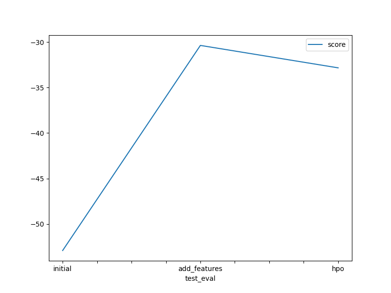

# Report: Predict Bike Sharing Demand with AutoGluon Solution
#### Ajeet Singh

## Initial Training
### What did you realize when you tried to submit your predictions? What changes were needed to the output of the predictor to submit your results?
Since all my values were above 0,I did not have any trouble in submitting.
### What was the top ranked model that performed?
WeightedEnsemble_L3
## Exploratory data analysis and feature creation
### What did the exploratory analysis find and how did you add additional features?
It showed that the bike sharing demand was dependent on the season which is directly linked to the month,it was also dependent on the sunlight as well whether it was a weekend or not.So hour,month,day and day of the week were added as features.
### How much better did your model preform after adding additional features and why do you think that is?
It performed 64% better as the score improved from 1.79283 to 0.63628,Adding additional time related features improved the scores as 
people as likely to use bikes in good weather,in summer season and during daytime.
## Hyper parameter tuning
### How much better did your model preform after trying different hyper parameters?
From the inital score it was 74% lower and from the additional features run it was 25% lower.
It performed better because I used the top models from the previous two runs and hypertuned them to get a better result.
### If you were given more time with this dataset, where do you think you would spend more time?
I will perfomr EDA to find the correlation between other factors such as temp,humidity and wind speed as it can tell us what the weather
was when the demand soared and whether it was raining or not.
### Create a table with the models you ran, the hyperparameters modified, and the kaggle score.
|model|GBM|XGB|CAT|score|
|--|--|--|--|--|
|initial|default|default|default|1.79283|
|add_features|default|default|default|0.63628|
|hpo|'num_boost_round': 100|'n_estimators': 1000|'iterations': 1000|0.47550|

### Create a line plot showing the top model score for the three (or more) training runs during the project.

### Create a line plot showing the top kaggle score for the three (or more) prediction submissions during the project.

## Summary
I learned using AutoGuon which is a automatic machine learning library I can quickly build,analyze and improve machine learning modles in very few lines of code.